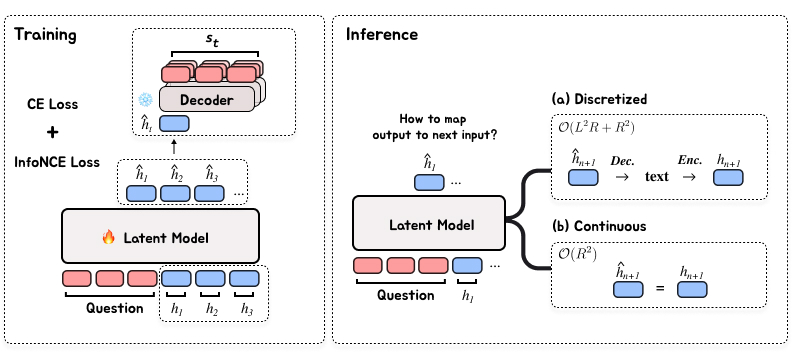
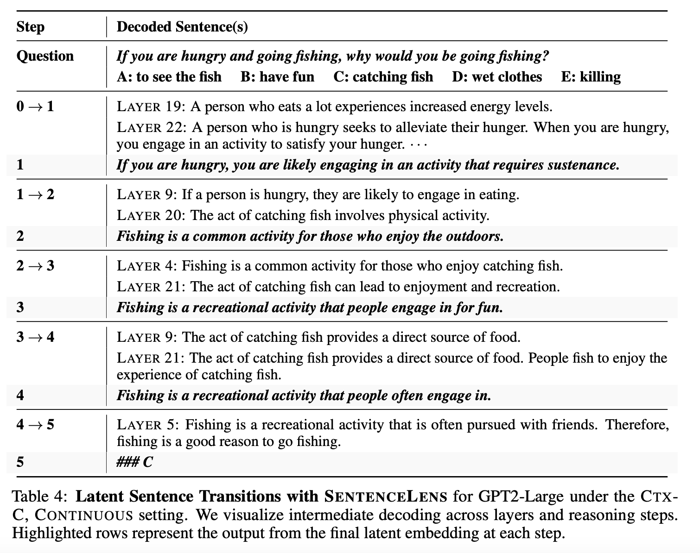

# Let's Predict Sentence by Sentence 🔮

[](https://arxiv.org/abs/2505.22202)
[](https://opensource.org/licenses/MIT)
[](https://www.python.org/downloads/)

This repository contains the *official* implementation of the paper **"Let's Predict Sentence by Sentence"**.

> 📖 **[Read the Paper](https://arxiv.org/abs/2505.22202)** | 🌟 **[Star this Repo](https://github.com/hbin0701/pred-sent)** | 🐛 **[Report Issues](https://github.com/hbin0701/pred-sent/issues)**



## 📝 Overview

> We present a novel framework that **adapts** pre-trained token-level Language Models to operate in sentence space by autoregressively predicting continuous embeddings of next sentences.

## 📁 Directory Structure

```text
pred-sent/
├── data/                           # Pre‑packed benchmark datasets
│   ├── blocksworld7/              # Planning task dataset
│   ├── csqa/                      # Commonsense QA dataset
│   ├── gsm8k/                     # Mathematical reasoning dataset
│   └── prosqa/                    # Logical reasoning dataset
│   └── *.json
└── src/                           # Source code & training pipelines
    ├── autoreg_ctx/               # Contextual‑embedding latent model
    ├── autoreg_sem/               # Semantic‑embedding latent model
    ├── emb_ctx/                   # Contextual embedding training
    ├── emb_sem/                   # Semantic embedding training
    ├── sentence_lens/             # SentenceLens inference
    └── sft/                       # Supervised fine-tuning baselines
```

Each module contains its own **`train.py`**, **`main.py`**, and **`run.sh`** for standalone execution.

## 🚀 Getting Started

### Installation

1. **Clone the Repository**
```bash
git clone https://github.com/hbin0701/pred-sent.git
cd pred-sent
```

2. **Set Up Environment**
```bash
# Create and activate Conda environment
conda env create -f environment.yml
conda activate pred-sent
```

3. **Download Datasets** (Optional)
```bash
bash scripts/download_data.sh  # ~5 minutes / <1 GB
```

## 🔄 Training Pipeline

Our framework follows a three-stage training process:

1. **Stage 1: Supervised Fine-Tuning (SFT)**
   - Run SFT Model on your target task

2. **Stage 2: Embedding Training**
   - Choose between semantic (`emb_sem`) or contextual (`emb_ctx`) embedding
   - Generates input/target embeddings for the latent model

3. **Stage 3: Latent Model Training**
   - Freeze encoder/decoder from Stage 2, and train the latent model to input -> output these embeddings.

Overall, there are three available approaches (Table 2):
  ```
  Semantic:    SFT → emb_sem → autoreg_emb
  Context-B:   SFT → emb_ctx → autoreg_ctx
  Context-C:   SFT → emb_sem → emb_ctx → autoreg_ctx
  ```
Note: Context-C requires the emb_sem encoder for training the ctx-c decoder.


### Training Details

While you can run `run.sh` in each directory, for hyperparameters, please refer to Page 22 (Appendix E).

```bash
# Run the training script
bash scripts/run.sh
```

## 🔍 SentenceLens



You can also try **SentenceLens** - to visualize latent model trajectory. 
Download our model from [`hbin0701/csqa-gpt2-large-ctx-c`](https://huggingface.co/hbin0701/csqa-gpt2-large-ctx-c).

After, to use SentenceLens:

```bash
cd src/sentence_lens
bash run.sh
```

## 📊 Datasets

Our framework has been evaluated on various reasoning tasks:

- **GSM8K**: Mathematical reasoning
- **CSQA**: Commonsense question answering
- **ProsQA**: Logical reasoning
- **BlocksWorld**: Planning and sequential decision making


## 📄 Citation

If you find this work useful in your research, please cite our paper:

```bibtex
@misc{hwang2025letspredictsentencesentence,
      title={Let's Predict Sentence by Sentence}, 
      author={Hyeonbin Hwang and Byeongguk Jeon and Seungone Kim and Jiyeon Kim 
              and Hoyeon Chang and Sohee Yang and Seungpil Won and Dohaeng Lee 
              and Youbin Ahn and Minjoon Seo},
      year={2025},
      eprint={2505.22202},
      archivePrefix={arXiv},
      primaryClass={cs.CL},
      url={https://arxiv.org/abs/2505.22202}
}
```

## 📌 Note

-  The codebase has undergone many refactoring. 
-  So ... if you encounter any issues or have questions, please don't hesitate to open an issue on GitHub or reach out to the authors. (hbin0701 at kaist.ac.kr)

- 🐛 **Found a bug?** → [Open an issue](https://github.com/hbin0701/pred-sent/issues)
- 💬 **Have questions?** → Reach out to us at `hbin0701 at kaist.ac.kr`
- 🤝 **Want to discuss?** → We welcome conversations about related research topics!

> We also welcome any discussions about related topics! 😄

---
*One Day ... Could we develop AI that reasons in its own language..? 😄*
